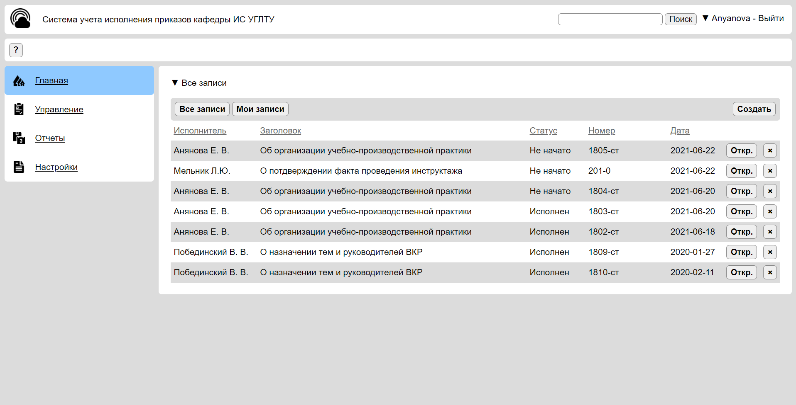

# Информационная система (веб-приложение) контроля исполнения приказов для кафедры интеллектуальных систем УГЛТУ 

  

# Как запустить
* Команда для запуска сервера: npm run server
* Необходимо настроить поключение к базе данных MySQL
* Файл структуры БД - test.sql